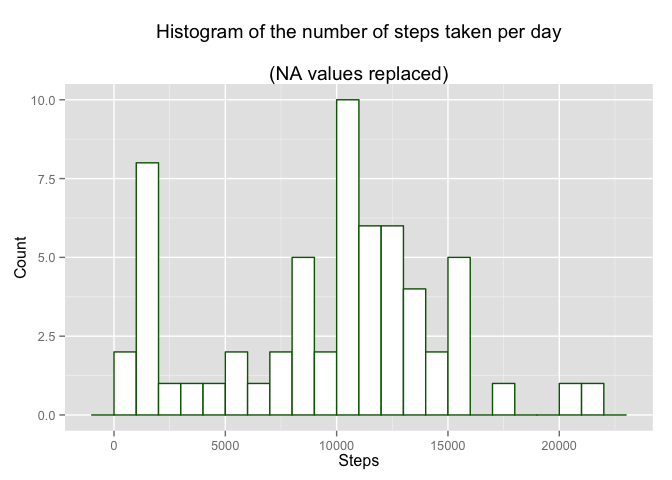

# Reproducible Research: Peer Assessment 1


## Loading and preprocessing the data
First, the packages that will be required for data analysis and plotting are 
loaded.

```r
library(dplyr)
library(ggplot2)
```

The data file must be present in the working directory for loading.
Headers are desired, but the date field should not be interpreted as a 
categorical variable on reading.

```r
activity <- read.csv("activity.csv", stringsAsFactors = FALSE)
```

It does need to be transformed though.

```r
activity$date <- as.Date(activity$date, format = "%Y-%m-%d")
```


In the original file, interval labels are stored as integer representations, 
starting at zero and increasing by five until an hour marker is reached, when 
they jump to the next multiple of 100. This allows them to be read easily as a 
record of the time when the interval begins. However, when plotted as a 
continuous scale this form of labelling introduces empty values. To avoid this 
the intervals are converted to a string of the form hh:mm and added as an extra 
column to the data frame.

```r
int_times <- activity$interval
int_times <- formatC(int_times, width = 4, format = "d", flag = "0")

for (i in 1:length(int_times)) {
        xxxx <- substring(int_times[i], c(1,3),c(2,4))
        int_times[i] <- paste(xxxx[1],xxxx[2], sep =":")
}

activity <- cbind(activity, int_times)
```


## What is mean total number of steps taken per day?
To plot the histogram, the sum of steps per day is calculated. The histogram 
binwidth is calculated using the Freedman-Diaconis rule.


```r
act_summ <- activity%>%
group_by(date) %>%
summarise(steps = sum(steps, na.rm = T))

bw <- with(act_summ, diff(range(steps)) / (2 * IQR(steps) / length(steps)^1/3))
hist_gg1 <- ggplot(act_summ, aes(steps))
hist_gg1 + geom_histogram(binwidth = bw, colour = "darkgreen", fill = "white") + 
        labs(title = "Histogram of the number of steps taken per day
             \n(NA values removed)", x = "Steps", y = "Count") 
```

 

The daily mean number of steps is:

```r
mean(act_summ$steps)
```

```
## [1] 9354.23
```

The daily median number of steps is:

```r
median(act_summ$steps)
```

```
## [1] 10395
```

## What is the average daily activity pattern?

First, the mean number of steps per interval is calculated:

```r
act_int <- activity %>%
group_by(int_times) %>%
summarise(ave_steps = mean(steps, na.rm = T))
```

This is plotted as a time series, with the intervals labelled as times:

```r
int_gg <- ggplot(act_int, aes(int_times, ave_steps, group=1)) 
int_gg + geom_line() +
        scale_x_discrete(breaks = c("00:00", "06:00", "12:00", "18:00", "23:55")) +
        labs(x = "Interval times", y = "Average number of steps")
```

 

The maximum interval begins at 08:35:

```r
act_int[act_int$ave_steps == max(act_int$ave_steps),]
```

```
## Source: local data frame [1 x 2]
## 
##   int_times ave_steps
## 1     08:35  206.1698
```


## Imputing missing values
Not all time intervals have a number of steps recorded. These are represented 
in the data by NA values. The total number of NA values is:

```r
sum(is.na(activity$steps))
```

```
## [1] 2304
```

By analysing the total number of NAs per day we can see that whole days are 
missing, not a mixture of individual values per day. (Each day contains 288 
intervals.)

```r
act_days <- activity %>%
    group_by(date) %>%
    summarise(steps = sum(is.na(steps))) %>%
    mutate(day = weekdays(date))

act_days[act_days$steps != 0 & act_days$steps != 288 ,]
```

```
## Source: local data frame [0 x 3]
```

There is no obvious pattern to the days in which no measurements were made:

```r
act_days[act_days$steps == 288,]
```

```
## Source: local data frame [8 x 3]
## 
##         date steps       day
## 1 2012-10-01   288    Monday
## 2 2012-10-08   288    Monday
## 3 2012-11-01   288  Thursday
## 4 2012-11-04   288    Sunday
## 5 2012-11-09   288    Friday
## 6 2012-11-10   288  Saturday
## 7 2012-11-14   288 Wednesday
## 8 2012-11-30   288    Friday
```

There is no indication of what may have caused the loss of data on these 
particular days, so the imputation strategy has to rely on data provided for 
the other days. The variation over different intervals through each day argues 
against using the daily mean, as this would be a gross over-estimate. The 
average for each interval would be a better substitute. The median was chosen as 
it is less influenced by outlying values.


```r
int_meds <- tapply(activity$steps, activity$interval, median, na.rm=T)
activity_imputed <- cbind(activity,medians = rep(int_meds,61))
for(i in seq(along=activity_imputed$steps)) {
    if(is.na(activity_imputed$steps[i])) {
        activity_imputed$steps[i] <- activity_imputed$medians[i]
    }
}
```

With the missing values replaced by interval medians, the histogram is subtly 
different:

```r
act_summ_imputed <- activity_imputed%>%
group_by(date) %>%
summarise(steps = sum(steps, na.rm = T))

bw <- with(act_summ_imputed, diff(range(steps)) / (2 * IQR(steps) / length(steps)^1/3))
hist_gg2 <- ggplot(act_summ_imputed, aes(steps))
hist_gg2 + geom_histogram(binwidth = bw, colour = "darkgreen", fill = "white") + 
        labs(title = "Histogram of the number of steps taken per day
             \n(NA values replaced)", x = "Steps", y = "Count") 
```

 

The daily mean has increased:

```r
mean(act_summ_imputed$steps)
```

```
## [1] 9503.869
```

The daily median remains unchanged, as expected given that interval medians were 
used to replace missing values:

```r
median(act_summ_imputed$steps)
```

```
## [1] 10395
```

## Are there differences in activity patterns between weekdays and weekends?

A new factor is introduced todiscriminate between weekdays and weekends.

```r
wkday <- c("Monday","Tuesday","Wednesday","Thursday","Friday")
act_panels <- mutate(activity_imputed, day_type = ifelse(weekdays(date) %in% wkday, "Weekday", "Weekend"))
act_panels$day_type <- as.factor(act_panels$day_type)
```

There are notable differences between activity levels at weekends and during the 
week. At weekends, activity starts later, ends later and contains less 
identifiable busy periods. Whereas, during the week, there is a pronounced peak 
at morning rush hour, and a less-defined peak in the early evening. For the rest 
of the day activity is less pronounced than at weekends.

```r
act_int_imp <- act_panels %>%
        group_by(int_times, day_type) %>%
        summarise(ave_steps = mean(steps))

act_int_imp$day_type <- factor(act_int_imp$day_type, levels = c("Weekend", "Weekday"))

act_gg <- ggplot(act_int_imp, aes(int_times, ave_steps, group=1))
act_gg + scale_x_discrete(breaks = (c("00:00", "06:00", "12:00",
        "18:00", "23:55"))) + facet_wrap(~day_type, nrow=2) + geom_line() +
        labs(x = "Interval times", y = "Average number of steps")
```

 
